# AWS Production Architecture: Chronos Birthday API

## 1. Context & Scope
The Chronos Birthday API is a lightweight service exposing two routes (`PUT /hello/{username}` and `GET /hello/{username}`) backed by a relational database[cite: 1, 2].

This document outlines the target AWS production design to operate this service under high availability and sustained traffic. The primary baseline deploys **Amazon EKS** across three Availability Zones (`us-east-1a`, `us-east-1b`, `us-east-1c`) paired with a managed **Amazon Aurora PostgreSQL** cluster, while evaluating standard Amazon RDS and in-cluster database operators as alternatives.

---

## 2. Target Architecture

  

---

## 3. Infrastructure Walkthrough

### 3.1 Network Topology & Ingress Path
* **VPC Layout:** Dedicated `/16` VPC spanning 3 Availability Zones. Public subnets host only internet-facing Application Load Balancers and NAT Gateways. EKS worker nodes, database subnets, and VPC endpoints live in private subnets with no public IPv4 assignment.
* **Edge & TLS:** Route 53 routes incoming DNS traffic to a multi-AZ ALB. TLS termination is handled at the ALB using ACM-managed certificates. AWS WAF is attached to the ALB to enforce IP rate limiting and standard OWASP rule sets.
* **Direct Pod Ingress:** The AWS Load Balancer Controller runs in `target-type: ip` mode. Paired with the AWS VPC CNI, the ALB routes traffic straight to pod IP addresses, bypassing `kube-proxy` NodePort hops and internal iptables overhead.

### 3.2 Compute & Scaling (Amazon EKS)
* **Cluster Baseline:** Managed EKS with private API endpoint access and KMS CMK envelope encryption for Kubern* **Autoscaling:** An HPA scales pods across AZs, based on CPU usage versus some threshold. Custom HTTP request metrics can be fed into HPA via `prometheus-adapter` during sudden traffic bursts. Karpenter observes pending pods and spins up right-sized EC2 compute (mixing ARM64 and AMD64 on-demand AND spot instances) across all three AZs.
* **Autoscaling:** An HPA scales pods between AZs based on a CPU threshold. Custom HTTP request metrics can be fed into HPA via `prometheus-adapter` during sudden traffic bursts. Karpenter observes pending pods and spins up right-sized EC2 compute (mixing ARM64 and AMD64 instances) across all three AZs.

### 3.3 Database Tier & State Persistence
* **Amazon Aurora PostgreSQL (Multi-AZ):**
  * One primary writer and one read replica deployed in separate AZs, backed by shared storage replicated 6 ways across 3 AZs.
  * Storage grows automatically in 10 GB increments up to 128 TiB without requiring downtime or storage modification cooldowns.
  * Failover promotes the read replica to writer by updating cluster DNS endpoints, typically resolving in roughly 15 to 30 seconds depending on client connection retry settings.
  * WAL archiving streams directly to S3, giving point-in-time recovery without degrading writer instance I/O.
* **Connection Pooling:** Fast HPA scaling can exhaust backend PostgreSQL process limits. An Amazon RDS Proxy instance sits between EKS pods and Aurora to pool and multiplex connections.
* **Database Migrations:** Startup table creation (`Base.metadata.create_all`) is used for local tests only. Production DDL migrations run out-of-band as an Alembic Kubernetes Job prior to pod rollouts.

### 3.4 Workload Identity & Credential Lifecycle
* **Identity:** Pods assume IAM roles via EKS Pod Identity / IRSA using OIDC token projection, eliminating static AWS access keys.
* **Secrets Synchronization:** Database credentials reside in AWS Secrets Manager and are mirrored into Kubernetes Secrets by the External Secrets Operator (ESO).
* **Zero-Downtime Secret Rotation:** To prevent dropped connections when passwords rotate, we use an alternating dual-user approach (`app_user_a` / `app_user_b`):
  1. A VPC-attached rotation Lambda (configured with private subnet ENIs and security group access to port 5432) executes `ALTER USER` directly on the primary Aurora cluster endpoint for the inactive user.
  2. Secrets Manager updates the active secret payload to reference the newly updated credentials.
  3. ESO pulls the updated secret on its sync schedule and updates the in-cluster `Secret`.
  4. Stakater Reloader detects the secret update and rolls the API deployment.
  5. The previous user remains valid until all old pods terminate, preventing 503s on in-flight traffic.
* **Container Hardening:** Containers run as non-root (`appuser`, UID 10001), drop all Linux capabilities (`drop: ["ALL"]`), and mount root filesystems in read-only mode.

---

## 4. Required Helm Chart Components

| File / Manifest | Role in Deployment |
| :--- | :--- |
| `Chart.yaml` | Defines chart metadata, API version (`v2`), semantic versioning (`version`, `appVersion`), and dependencies[cite: 1, 2]. |
| `values.yaml` | Configuration contract defining environment overrides, replica boundaries, image tags, resource limits, probe paths, and ingress rules[cite: 1, 2]. |
| `templates/_helpers.tpl` | Go template helpers for consistent resource names and standard labels (`app.kubernetes.io/name`)[cite: 1, 2]. |
| `templates/deployment.yaml` | Declares container runtime specs, replica counts, port bindings, security contexts, and `/healthz` probe endpoints[cite: 1, 2]. |
| `templates/service.yaml` | Exposes an internal `ClusterIP` to distribute traffic across active pod endpoints[cite: 1, 2]. |
| `templates/ingress.yaml` | Ingress resource with ALB controller annotations (`scheme: internet-facing`, `target-type: ip`) and path routing rules[cite: 1, 2]. |
| `templates/configmap.yaml` & `templates/secret.yaml` | Inject non-sensitive environment configuration and sensitive database connection credentials[cite: 1, 2]. |
| `templates/hpa.yaml` | Configures the Horizontal Pod Autoscaler min/max boundaries and metric thresholds[cite: 1, 2]. |
| `templates/pdb.yaml` | Defines `PodDisruptionBudget` rules to guarantee minimum pod availability during voluntary node maintenance[cite: 1, 2]. |
| `templates/serviceaccount.yaml` | Associates the workload with Kubernetes RBAC and mounts the AWS IRSA IAM role ARN parameterized via `values.yaml`. |

---

## 5. Architectural Trade-Offs & Decisions

### 5.1 Persistence Tier Comparison

| Architecture Pattern | Compute Tier | Persistence Tier | Primary Advantages | Operational Realities & Costs |
| :--- | :--- | :--- | :--- | :--- |
| **A. EKS + Amazon Aurora** *(Selected Baseline)* | EKS + Karpenter | Amazon Aurora PostgreSQL Multi-AZ | • 6-way replicated storage across 3 AZs. • Faster DNS failover (~15–30s). • Automatic storage scaling to 128 TiB. | • Higher hourly cost (compute baseline + I/O request charges). • Fast pod scale-outs require RDS Proxy. |
| **B. EKS + Standard RDS** | EKS + Karpenter | Amazon RDS PostgreSQL Multi-AZ | • Managed backups and minor version patching. • Predictable `gp3` storage pricing. | • Slower failover (60–120s while standby mounts EBS and performs crash recovery). • Volume expansion requires managing storage cooldown periods. |
| **C. EKS + DB Operator** | EKS + Karpenter | Percona Operator / CloudNativePG on EBS | • Cloud-neutral; unified GitOps workflow for app and data layers. • No managed database service margins. | • Platform team owns operator upgrades, PVC disk headroom, WAL tuning, and restore drills. |
| **D. Serverless Stack** | API Gateway + Lambda | Amazon DynamoDB (On-Demand) | • Scales to zero when idle. • Minimal infrastructure maintenance; no node management. | • Cold-start tail latency. • Binds application logic to AWS SDKs (`boto3` / DynamoDB APIs). |

---

### 5.2 Decision Rationale

#### Why Aurora Over RDS & In-Cluster Operators?
* **Over In-Cluster Operators:** Running PostgreSQL inside EKS via operators like Percona or CloudNativePG is portable, but shifts the responsibility of storage expansion, consensus monitoring, backup validation, and node recovery onto the internal platform team.
* **Over Standard RDS:** Standard RDS Multi-AZ uses block-level storage replication, resulting in longer failover windows (often 60–120s) while completing crash recovery. For high-criticality workloads, Aurora's purpose-built storage layer and rapid failover justify the higher base cost.

#### Why EKS Over Serverless?
For a key-value access pattern (`username`: `dateOfBirth`), an AWS Serverless stack (**API Gateway + Lambda + DynamoDB**) is an effective option that scales to zero and eliminates cluster administration.

The containerized **EKS + PostgreSQL** baseline was selected because the project requirements explicitly call for packaging and testing the service with a Helm chart. Running containerized FastAPI on Kubernetes lets us validate the exact same container image, configuration, and database drivers locally on `kind` during CI before promoting to AWS, while keeping the core application decoupled from proprietary cloud database APIs.
